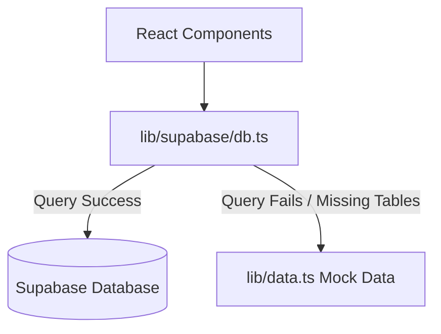

# Bright Future Academy - Production-Ready Implementation Plan

This plan details the steps to transition the BFA Web MVP from a static mockup to a production-ready system. We will address major security vulnerabilities, bridge the database functionality gaps, and enhance the user experience.

---

## User Review Required

> [!IMPORTANT]
> **1. Client-Side User Provisioning Session Bug**
> In the current implementation of `src/pages/admin/AdminPortalAccounts.tsx` and `src/lib/supabase/admin.ts`, when an administrator creates a new student, teacher, or parent account, it calls `supabase.auth.signUp()`. Under default Supabase settings, this immediately logs the admin out and logs them in as the newly created user, hijacking the admin session.
> *Proposed Solution:* We will create a secondary, non-session-persisting Supabase client specifically for provisioning. This allows the admin to register new accounts without losing their active session.
>
> **2. Row-Level Security (RLS) & Profile Access**
> The current Supabase database setup restricts profile inserts strictly to `auth.uid() = id`. This blocks the administrator from writing profile rows for newly provisioned teachers/students/parents.
> *Proposed Solution:* We suggest updating the database schema with an RLS policy that explicitly allows users with the `admin` role to manage all profiles. We will provide the SQL script in a system page or dashboard banner.

---

## Open Questions

> [!NOTE]
> **Admissions & Student Integration**
> When an admin approves an admission application and selects **"Enroll"**, should the system automatically create a new student portal account and student profile in the database?
> *Proposed Behavior:* Yes, we will implement an "Enroll" button in the Admin Admissions dashboard. Clicking this will trigger the creation of a student profile in the `students` table, linked to the corresponding parent if available.

---

## Proposed Changes

We will introduce a robust database abstraction layer with automatic fallback to mock data (for easy local preview and testing if Supabase tables are not fully configured yet).

---

### Component 1: Database Services & Config (`src/lib/supabase`)

#### [NEW] [db.ts](file:///c:/Users/Admin/Desktop/BFA/src/lib/supabase/db.ts)
A database helper service that exposes CRUD operations for all resources (`students`, `teachers`, `classes`, `announcements`, `assignments`, `events`, `admissions`, `grades`, `attendance`).
- Every query is wrapped in `try-catch`.
- If a query fails (e.g. `42P01: relation does not exist` when tables are not yet set up), it logs a developer warning and returns the corresponding mock data array from `src/lib/data.ts` or local storage state.
- Exposes mutations (e.g. `addStudent`, `updateAdmissionStatus`, `createAnnouncement`) that sync to Supabase and update local mock states.

#### [MODIFY] [admin.ts](file:///c:/Users/Admin/Desktop/BFA/src/lib/supabase/admin.ts)
- Initialize a secondary `signupClient` using `createClient(url, key, { auth: { persistSession: false } })` to resolve the administrator session hijack bug.
- Use `signupClient.auth.signUp()` for account creation to keep the admin's authentication state undisturbed.

---

### Component 2: Admissions Driven Workflow (`src/pages`)

#### [MODIFY] [Admissions.tsx](file:///c:/Users/Admin/Desktop/BFA/src/pages/Admissions.tsx)
- Replace the static "Download Application Form" call-to-action with a modern, step-by-step **Online Admission Application Form**.
- Gather student name, date of birth, gender, grade applying, parent contact info (name, phone, email), and address.
- Save submissions directly to the `admissions` table using `db.ts`. Show a glassmorphism success notification on submission.

#### [MODIFY] [AdminAdmissions.tsx](file:///c:/Users/Admin/Desktop/BFA/src/pages/admin/AdminAdmissions.tsx)
- Load actual applications from Supabase with status filters (Pending, Approved, Rejected, Enrolled).
- Add action buttons: **Approve**, **Reject**, and **Enroll** (which updates the database status dynamically).
- Display a toast/notification after status updates.

---

### Component 3: Admin Dashboard & CRUD Pages (`src/pages/admin`)

#### [MODIFY] [AdminOverview.tsx](file:///c:/Users/Admin/Desktop/BFA/src/pages/admin/AdminOverview.tsx)
- Replace static stat counts (`stats` array) with live counts aggregated from database queries (total active students, total teachers, total classes, and pending admissions).
- Query the database for the 5 most recently created students.

#### [MODIFY] [AdminStudents.tsx](file:///c:/Users/Admin/Desktop/BFA/src/pages/admin/AdminStudents.tsx)
- Query the `students` table.
- Implement an interactive **"Add Student" Modal Form** that collects name, admission number, class, gender, DOB, phone, and status, and saves it to Supabase.

#### [MODIFY] [AdminTeachers.tsx](file:///c:/Users/Admin/Desktop/BFA/src/pages/admin/AdminTeachers.tsx)
- Query the `teachers` table.
- Implement an interactive **"Add Teacher" Modal Form** (collecting name, email, employee number, qualifications, specialization) and save to Supabase.

#### [MODIFY] [AdminClasses.tsx](file:///c:/Users/Admin/Desktop/BFA/src/pages/admin/AdminClasses.tsx)
- Query the `classes` table.
- Implement an interactive **"Add Class" Modal Form** linked with teacher selection and save to Supabase.

#### [MODIFY] [AdminAnnouncements.tsx](file:///c:/Users/Admin/Desktop/BFA/src/pages/admin/AdminAnnouncements.tsx)
- Query the `announcements` table.
- Implement an interactive **"New Announcement" Form** (title, content, target role) that writes directly to the database.

---

### Component 4: Role-Based Portals (`src/pages/teacher`, `src/pages/student`, `src/pages/parent`)

- Update the role-specific dashboards to load real assignments, results, timetable entries, and announcements filtered by the current user's profile context.
- Implement the **Teacher Attendance** marking screen to save attendance data directly to the database.
- Implement the **Teacher Results** screen to insert student exam grades into the `grades` table.

---

### Component 5: UI/UX & Styling Refinements

- **Glassmorphism Elements**: Enhance cards, sidebar, and headers with subtle backdrop-blur and border colors.
- **Dynamic Indicators**: Show a "Database Mode" vs. "Demo Mode (Mock Data)" indicator in the header of the portals to clarify whether the app is running off static data or a connected database.
- **Animations**: Apply smooth transition-all classes, micro-scale on button hovers, and slide-in effects for modals.

---

## Verification Plan

### Automated Tests
- Run `npm run lint` using Oxlint to verify code cleanlines.
- Build the bundle using `npm run build` to ensure all TypeScript and Vite compilation checks pass.

### Manual Verification
1. Open the public Admissions page, submit a student admission application, and verify it registers.
2. Sign in as Admin, go to Admissions, verify the application displays, and approve/enroll it.
3. Add students and teachers through the admin panel and confirm they render in tables.
4. Verify the admin remains logged in after provisioning a user (confirming the signup client fix).
5. Disconnect database environment variables (or simulate a DB crash) to verify that the app gracefully falls back to mock data mode with a warning badge, remaining fully functional.
